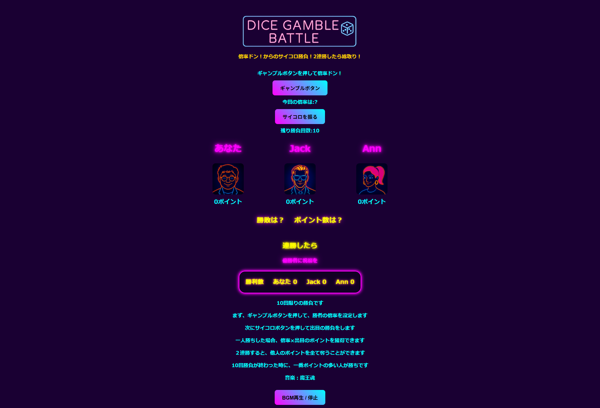

# 1.サイコロバトル（じゃんけんアプリリッチバージョン）

## 2. 課題内容（どんな作品か）
- 最初にギャンブルボタンを押して、得点の倍率を決めます
- 次にサイコロボタンを押して出目勝負をします
- 出目が多い人が勝ち。一人勝ちの場合のみ倍率×出目のポイントが獲得できます
- 2連勝したら、ほかのプレイヤーのポイントを総取りできます
- 勝負は10回戦。10回プレイした後、ポイントが一番多い人が優勝です
- ジャズ風ピアノを聞きながらサイコロバトルをお楽しみください

## 3. アプリのデプロイURL
https://aratabplp-boop.github.io/SaikoroGame-JankenRich-/

## 4. ログインID＆Passsword
なし

## 5. 工夫した点、こだわった点
- ギャンブルボタンの設置。射幸性を出したかった
- ギャンブルボタン、サイコロボタンの制御。必要な時しか押せないように。これがけっこうやっかい。増築するたびにコンフリクト
- サイコロが回る？アニメーション
- じゃんけんアプリの要素を生かしつつ、別のギャンブルに挑戦したかった
- 全体的なデザイン、ネオンサイン風、ジャズピアノ

## 6. 備考（備忘録）
- 生成AIと相談しながら作っているが、前の2回と比べて手戻りや混乱は激減した
- 全体設計＆完成形を意識したうえで、HTMLをまず自力で書く。画面上のconst箱と処理Stepも書き出してみる。その上で、JSはStep（処理）ごとに相談していくスタイル。結果的に、Step（ネスト）ごとに挙動を確認しながら組み立てることができた
- ステップ５くらいまではかなりスムーズ。そのあたりで考慮漏れだった挙動を追加したら、しばらく辻褄が合わなくなりAIと険悪なムードに
- 考慮漏れだった挙動は、確かサイコロボタンのオンオフ。各種挙動の後にどんな展開にしたいかまで事前に洗い出しておけるとベストだとの学び（もちろん、動かしてみてアイデアが広がることもあるけれど）
- Gemini3.0 がリリースされたので相談相手として試してみた。GitHubについてのQAはとてもわかりやすいが、コード書いていくのはレベル感を合わせるのが難しい印象。copilotのsmart(GPT-5)がBuddyとしてちょうどよい・・・

